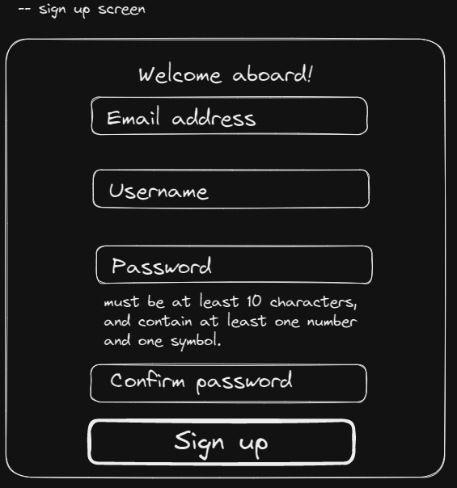
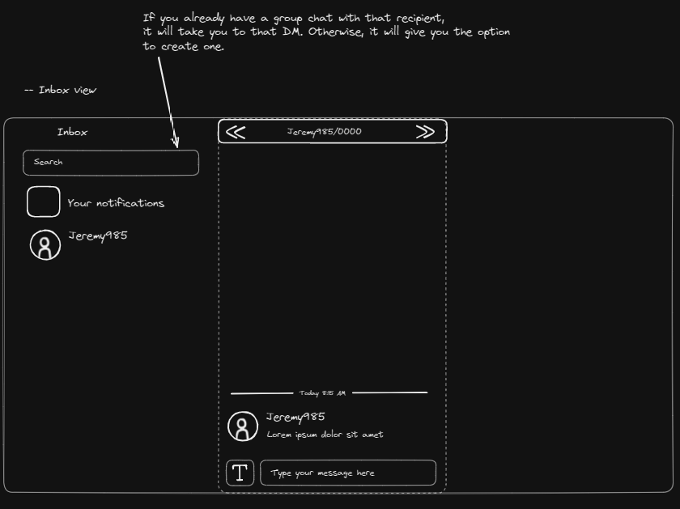
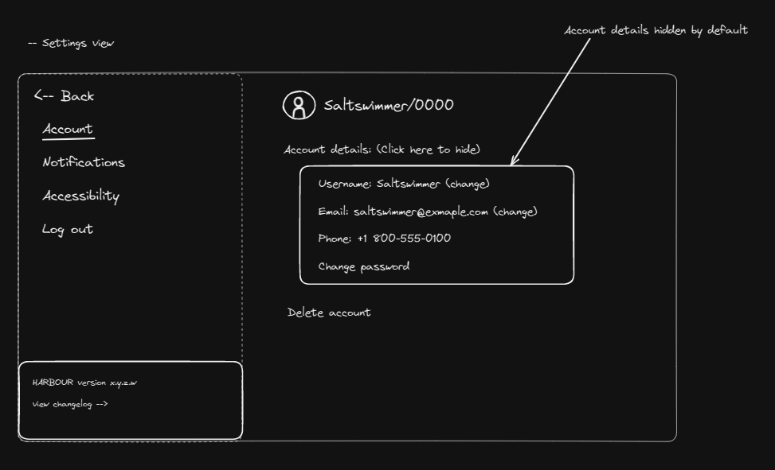
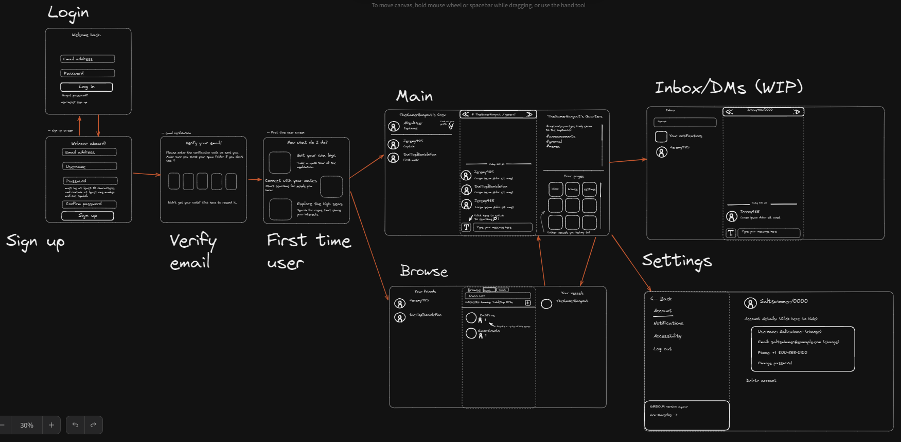
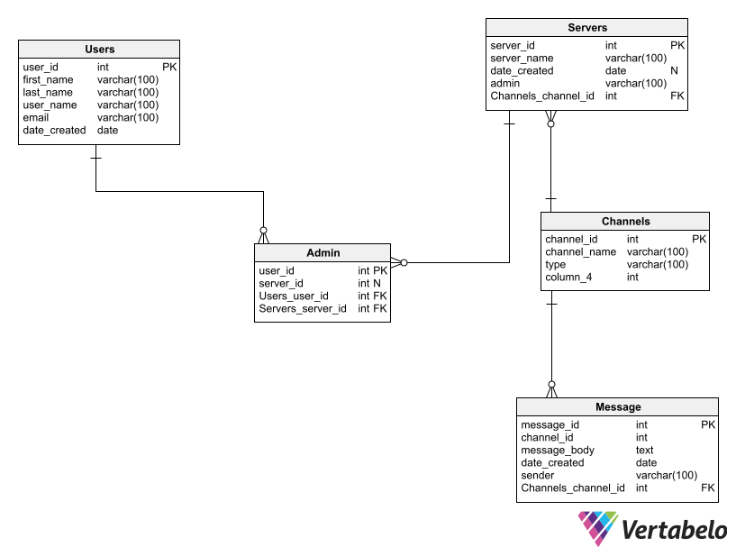

Harbour Chat App Design Document
================================
### High level Description:
* Harbour is a group chat application
* The game will start with a web application and hopes to include desktop and mobile applications
* After signing up and logging in, users will be able to join multiple "vessels" or group chats
* These "vessels" may be temporarily merged together, aka "boarding"
* Vessels may also be permanently merged, known as a "fleet"
* Users will also have the option to customize their personal profile, vessels, and client
### Approaches Considered:
* REACT vs. Flutter for frontend
  * One of our main concerns was what would be the easiest way to bring our application to multiple platforms, while still maintaining a low level of customization. We landed between REACT (which includes react router) and Flutter, both of which are excellent at building applications for multiple platforms. Ultimately we landed on Flutter, due to it's bundle size, performance, and the fact that everything is written in Dart as opposed to the multiple languages it would take to get REACT even just running. 
* Python vs. Go for backend
  * While the majority of team members have experience in python, it was ultimately we decided it would be a better option to implement the backend in Go, rather than a python web framework such as Django. First and foremost, many team members expressed interest in picking up the Go language, and since most team members will touch the backend at some point it will be a good learning experience and practice. In addition, we believe Go provides a functional advantage over python in how it handles concurrency, which while a bit "overboard" for an application of this scale, allows team members to implement a functionbly reliable and scalable option.
### Mockups:









#### Screen Navigation:



### Backend Information:


### API Endpoints:
#### User Information
* [/api] - Returns API doucmentation
* [/api/users/login] - Attempt to login with the given credentials
  * Expected Payload:
```
{
  username: USERNAME
  password: PASSWORD
}
```
  * Response:
```
{
  response: Successful/not successful
  has_2fa_enabled: true/false - Go to 2fa screen if needed
  token: the user's login token, if successful login and no 2fa
  userID: their user id
}
```
* [/api/users/twofactor] - Verify 2 factor authentication code
  * Expected Payload:
```
{
  username: USERNAME
  2fa_code: 2fa code
}
```
  * Response: 
```
{
  response: Successful/not successful
  token: the user's login token, if successful
}
```
* [/api/users/registration] - Register a new user
  * Expected Payload:
```
{
  username: USERNAME
  password: PASSWORD
  email: EMAIL
}
```
  * Response:
```
{
  response: successful/not successful
  token: the user's tokem, if successful
}
```
* [/api/users/logout] - Logout the user
  * Expected Payload:
```
{
  token: the user's token
}
```
* [/api/users/editprofile] - Edit a user's profile
  * Expected Payload:
```
{
  token: token
  list of user profile information: a bunch of rows consisting of what's changing
}
```
* [/api/users/userprofile] - Get a user's public user information
  * Expected Payload:
```
{
  userID: userID
}
```
  * Response:
```
{
  list of public user information, such as profile picture, name, etc
}
```
* [/api/users/userinfo] - Get a user's private information
  * Expected Payload:
```
{
  token: token
}
```
  * Response:
```
{
  list of private information, such as settings information, server list, DMs, etc
}
```
* [/api/users/search] - Get a list of users based off of a set of criteria
  * Expected Payload:
```
{
  name: user's name to search
  other search criteria like interests or shared servers, etc
}
```
  * Response:
```
{
  list: list of users
}
```

* [/api/users/match] - Get a recommended list of friends
  * Expected payload:
```
{
  token: token
}
```
  * Response:
```
{
   list: list of users
}
```
#### Server Information
* [/api/servers/serverinfooutside] - Server public information
  * Expected Payload:
```
{
  serverId: server id
}
```
  * Response:
```
  list of server public information, such as size, icon, name, etc
```
* [/api/servers/serverinfoinside] - List of server information for the members
  * Expected Payload:
```
{
  token: token
  serverId: server id
}
```
  * Response:
```
  list of server information, such as channels and user status
```
* [/api/servers/search] - Search for servers based on attributes
  * Expected Payload:
```
{
  name: name
  other attributes such as focuses
}
```
  * Response:
```
  list of servers
```
* [/api/servers/match] - Get a list or one (to be determined) other server to board based on recommendations
  * Expected Payload:
```
{
  serverId: serverId
  token: the user that requested the search for a match
}
```
  * Response:
```
  one or more servers based on the match recommendations
```
* [/api/servers/editserver] - Change server settings
  * Expected Payload:
```
{
  token: the user that made the change (should be administrator only)
  list of changes made such as adding a new channel, changing color scheme, etc
}
```
* [/api/servers/channel/chat] - Send a message in chat!
  * Expected Payload:
```
{
  message: message
  token: user sending the message
  channel: the channel the message is sent in
}
```
* [/api/servers/channel/chatget] - Get chat logs
  * Expected Payload:
```
{
  token: user requesting the logs
  startDate: the date to look before, in case the user is really looking back  
}
```
  * Response:
```
  message list
```
* [/api/servers/merge] - Two servers temporarily merge!
  * Expected Payload:
```
{
  serverId: the server to merge with
  token: the user authorizing the merge (should be administrator only?)
}
```
  * Response:
```
{
  servers merged: list of servers currently merged with. this allows for merging with multiple servers at once
}
```
* [/api/servers/endmerge] - End merge between two ships
  * Expected Payload:
```
{
  serverId: server to sever connection with
  token: the user cutting the connection
}
```

### Functionality provided by each screen:
* __Login__
  * Users can sign into their account by entering their email and password
  * If a user forgets their password, they can request a password reset
  * New users can hit the "sign up" link to go to the registration screen
  * If the user has 2FA set up, they will be given a 2FA prompt
  * Used API endpoints:
    * /api/users/login
    * /api/users/twofactor
* __Sign up__
  * Users sign up by entering an email, username, and password
  * Used API endpoints:
    * /api/users/registration
* __First time user__
  * Appears after a user registers and verifies their email
  * Just gives the user some pointers on how to get started
* __Main view__
  * This is where the user will spend most of their time
  * In the middle, the main view shows the current server and channel
  * One side panel shows the members of the current server
  * The other displays the channels as well as the other servers that the user can connect to
  * Used API endpoints:
    * /api/servers/serverinfoinside
    * /api/servers/editserver
    * /api/servers/channel/chat
    * /api/servers/channel/chatget
    * /api/servers/merge
    * /api/servers/endmerge
* __Browse view__
  * Allows the user to search for people and other servers
  * Individual users can make friend requests or request to be invited onboard a server
* __Inbox view__
  * Displays all of the user's direct message conversations
  * The user can also view their notifications from this screen
   * The notifications are treated like a read-only DM conversation
  * DMs will probably be implemented in a very similar way to how servers are implemented
* __Settings view__
  * Allows the user to adjust settings

### User Authentication / Data Security Considerations:
* Passwords must be hashed and never stored as plaintext
* User Authentication will require email verification
* Login API's from other websites such as Google may also be used for user authentication
* Spam protection to avoid client/server interrupts
* Warn users being redirected by links
* Private messages may be end-to-end encrypted
* Servers may select security options, such as:
  * Invitation may or may not be required
  * Ability for admins to manage/remove users or messages
### Tech stack:
* __Platform__
  * WebApp, Mobile app, Desktop app
* __Development Tools__
  * Version Control: Git - hosted on Github
  * Dependency Management: Poetry
* __Frontend__
  * Flutter
* __Backend__
  * GoLang
  * Docker
  * PostgreSQL
  * GraphQL
  * Hosting

### Goals and who they've been assigned to:
* __Ethan Ciavolella <ciavol43@students.rowan.edu>__
  * Frontend
* __Shane Cleary <cleary92@students.rowan.edu>__
  * Backend,
  Database
* __Eric Heitmann <heitma24@students.rowan.edu>__
  * Frontend,
  * Backend
* __Evan Kaminsky <kamins39@students.rowan.edu>__
  * Dev-Ops,
* __Joseph Tommasi <tommas95@students.rowan.edu>__
  * Database,
  * API management
