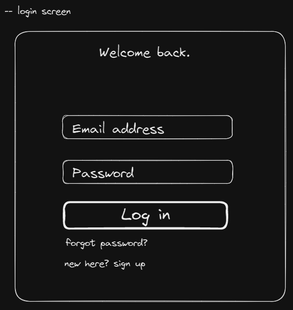

Harbour Chat App Design Document
================================
#### High level Description:

#### Approaches Considered:
* REACT vs. Flutter for frontend

#### Mockups:

#### Screen Navigation:

#### Backend Information:

#### Functionality provided by each screen:

#### User Authentication / Data Security Considerations:

#### Tech stack:
* __Frontend__
  * Flutter
    *
* __Backend__
  * Docker
    * 
  * Postgres
    * 
  * GraphQL
    * 
  * Hosting
    * 
* __Development Tools__
  * Github
    * 

#### Goals and who they've been assigned to:
* __Ethan Ciavolella <ciavol43@students.rowan.edu>__
  * 
* __Shane Cleary <cleary92@students.rowan.edu>__
  * 
* __Eric Heitmann <heitma24@students.rowan.edu>__
  * 
* __Evan Kaminsky <kamins39@students.rowan.edu>__
  * 
* __Joseph Tommasi <tommas95@students.rowan.edu>__
  * 
